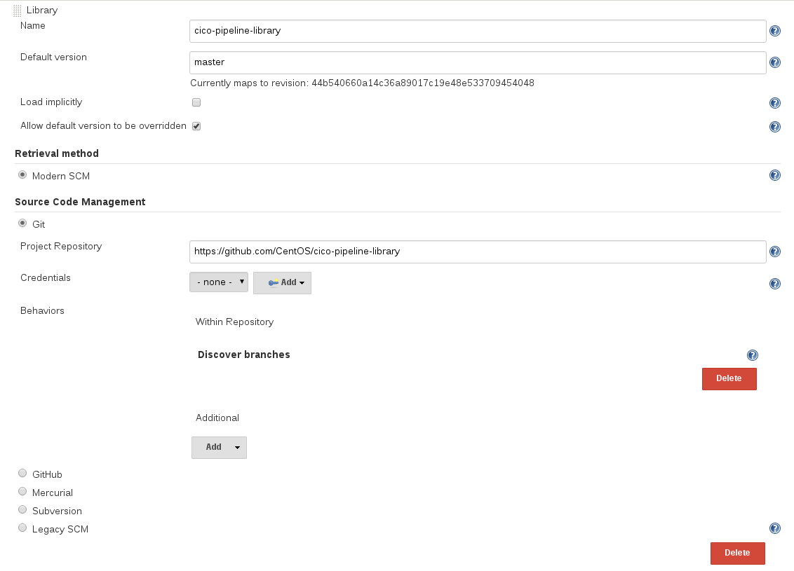

# CentOS CI Jenkins Pipeline Shared Libraries

Shared Library and example code to use Jenkinsfiles based Jenkins Pipelines in 
[ci.centos.org](https://ci.centos.org)

## Pre-requisites 

* Jenkins 2.30+
* [Pipeline Shared Libraries](https://github.com/jenkinsci/workflow-cps-global-lib-plugin) plugin
* Other plugins may be required for specific library calls (i.e. Docker)

## Usage

1. Add global library 'cico-pipeline-library' pointing to github location [https://github.com/CentOS/cico-pipeline-library](https://github.com/CentOS/cico-pipeline-library) <br> 
   in (Manage Jenkins > Configure System > Global Pipeline Libraries)
   
2. Add `@Library('cico-pipeline-library') _` into your pipeline definition more details: 
   1. https://github.com/jenkinsci/workflow-cps-global-lib-plugin
   2. https://jenkins.io/doc/book/pipeline/shared-libraries/
   

## Examples

### Basic Duffy Example

#### vars/ciPipeline.groovy
```
import org.centos.Utils

def call(body) {

    def config = [:]
    body.resolveStrategy = Closure.DELEGATE_FIRST
    body.delegate = config
    body()

    def getDuffy = new Utils()
    try {
        def current_stage = 'cico-pipeline-lib-stage1'
        stage(current_stage) {
            getDuffy.duffyCciskel(current_stage)

        }
        current_stage = 'cico-pipeline-lib-stage2'
        stage(current_stage) {
            getDuffy.duffyCciskel(current_stage)
        }
    } catch (err) {
        echo "Error: Exception from " + current_stage + ":"
        echo e.getMessage()
        throw err
    }
}
```

#### Jenkinsfile
```
@Library('cico-pipeline-library') _

node {
    deleteDir()
    ciPipeline {

    }
}
```